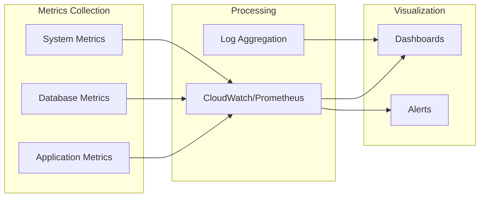

# Customer Onboarding Considerations

## A. Initial Configuration Concerns

Looking at the architecture, key information to obtain from customers:

1. **Network & Security**
   - VPC CIDR ranges and subnet configurations
   - Security group rules and NACLs
   - SSL certificate management
   - IAM roles and permissions

2. **Scale Requirements**
   - Number of developers (mentioned: 1000+)
   - Peak concurrent requests
   - Data volume for training
   - Expected growth rate

3. **Compliance & Governance**
   - Data residency requirements
   - Audit logging needs
   - Backup and retention policies
   - Encryption requirements (at rest/in transit)

4. **Integration Points**
   - Existing authentication systems (LDAP/SSO)
   - CI/CD pipeline integration
   - Monitoring and alerting systems
   - Source code repositories

## B. Healthy Onboarding Suggestions

### Phase 1: Pilot (Week 1-2)
- Deploy to isolated development VPC
- Onboard 10-20 power users
- Collect performance baselines
- Validate integration points

### Phase 2: Limited Rollout (Week 3-4)
- Expand to 100 developers
- Implement monitoring and alerting
- Fine-tune model with customer data
- Document customer-specific configurations

### Phase 3: Full Deployment (Week 5-6)
- Gradual rollout to all 1000+ developers
- Implement auto-scaling policies
- Enable full observability stack
- Establish support procedures

## C. Observability Strategy

**Key Observability Points**:
1. **Application Level**
   - API response times (p50, p95, p99)
   - Request volume and error rates
   - Model inference latency
   - Cache hit rates

2. **Database Level**
   - Query performance
   - Connection pool utilization
   - Training job queue depth
   - Vector search performance

3. **System Level**
   - CPU/Memory utilization
   - Disk I/O and space
   - Network throughput
   - Container health
