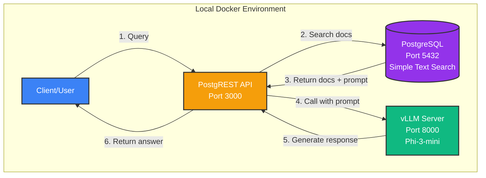
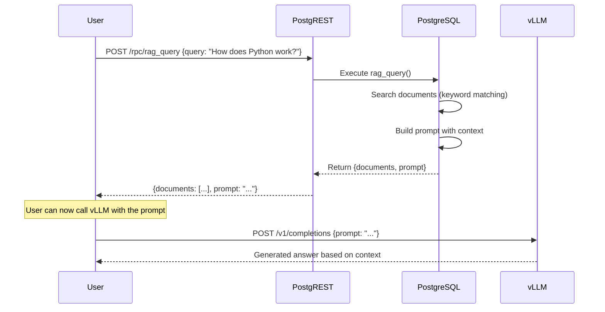

# Simple RAG System - Demo Implementation

## Architecture Diagram



## Data Flow Diagram



## Quick Start

1. **Prerequisites**
   - Docker and Docker Compose installed
   - Ports 3000, 5432, and 8000 available
   - At least 4GB RAM (for vLLM model)

2. **Start the system**
   ```bash
   docker-compose up -d
   ```

3. **Wait for services to be ready** (vLLM takes ~30s to load the model)
   ```bash
   # Check logs
   docker-compose logs -f vllm
   ```

4. **Test the RAG system**
   ```bash
   # Search documents
   curl "http://localhost:3000/rpc/search_documents" \
     -H "Content-Type: application/json" \
     -d '{"query_text": "python", "limit_count": 3}'

   # Get RAG query with prompt
   curl "http://localhost:3000/rpc/rag_query" \
     -H "Content-Type: application/json" \
     -d '{"user_query": "How does Python work?"}'

   # Call vLLM directly
   curl "http://localhost:8000/v1/completions" \
     -H "Content-Type: application/json" \
     -d '{
       "model": "microsoft/Phi-3-mini-4k-instruct",
       "prompt": "What is Python?",
       "max_tokens": 100
     }'
   ```

5. **Stop the system**
   ```bash
   docker-compose down
   ```

## Core Components

### 1. Plain PostgreSQL
- **Purpose**: Document storage and simple text search
- **Features**:
  - Simple keyword-based document retrieval
  - Full-text search indexes (GIN)
  - No complex extensions needed
- **Why Simple?**:
  - Easy to understand and debug
  - No vector embeddings complexity
  - Fast to set up

### 2. PostgREST
- **Purpose**: Auto-generated REST API from database schema
- **Features**:
  - Zero-code API endpoints
  - Direct function calls via `/rpc/` endpoints
- **Benefits**:
  - No API layer to write
  - Database functions become API endpoints

### 3. LLM Endpoint (External or Local)
- **Purpose**: LLM inference for generating responses
- **Options**:
  - **External vLLM**: Point to your existing vLLM server
  - **OpenAI API**: Use GPT-3.5/GPT-4
  - **Local vLLM**: Optional docker container (see docker-compose.vllm.yml)
- **Benefits**:
  - Flexible deployment
  - Works with any OpenAI-compatible API
  - No vendor lock-in

## API Endpoints

### PostgREST API (Port 3000)

| Endpoint | Method | Description |
|----------|--------|-------------|
| `/hello` | GET | Test endpoint returning "hello world" |
| `/rag_documents` | GET | List all documents |
| `/rag_documents` | POST | Add new document |
| `/conversations` | GET | View conversation history |
| `/conversations` | POST | Save conversation |
| `/rpc/search_documents` | POST | Search docs by keywords |
| `/rpc/rag_query` | POST | Get docs + formatted prompt for LLM |

### LLM API (Configurable Endpoint)

| Endpoint | Method | Description |
|----------|--------|-------------|
| `/v1/completions` | POST | Text completion (OpenAI compatible) |
| `/v1/chat/completions` | POST | Chat completion |
| `/health` | GET | Health check (vLLM) |
| `/v1/models` | GET | List available models |

## How RAG Works (Simplified)

1. **Document Storage**: Documents stored in PostgreSQL with title + content
2. **Search**: Keyword matching (no embeddings needed)
   - Searches in both title and content
   - Scores based on word frequency
3. **Context Building**: Top matching docs formatted into a prompt
4. **LLM Call**: Client calls vLLM with the generated prompt
5. **Response**: LLM generates answer based on context

## Example: Complete RAG Flow

```bash
# 1. Search for documents about Python
curl "http://localhost:3000/rpc/search_documents" \
  -H "Content-Type: application/json" \
  -d '{"query_text": "python programming", "limit_count": 3}'

# Response:
# [
#   {
#     "id": 1,
#     "title": "Python Basics",
#     "content": "Python is a high-level programming language...",
#     "relevance": 4
#   }
# ]

# 2. Get RAG query with auto-generated prompt
curl "http://localhost:3000/rpc/rag_query" \
  -H "Content-Type: application/json" \
  -d '{"user_query": "What is Python used for?"}'

# Response includes:
# {
#   "query": "What is Python used for?",
#   "documents": [...],
#   "prompt": "Context documents:\n\nDocument 1 - Python Basics: ...\n\nUser question: What is Python used for?\n\nPlease answer..."
# }

# 3. Send prompt to vLLM
curl "http://localhost:8000/v1/completions" \
  -H "Content-Type: application/json" \
  -d '{
    "model": "microsoft/Phi-3-mini-4k-instruct",
    "prompt": "Context documents:\n\nDocument 1 - Python Basics: Python is a high-level programming language. It uses indentation for code blocks and has dynamic typing.\n\nUser question: What is Python used for?\n\nPlease answer the question based on the context documents provided above.",
    "max_tokens": 200
  }'
```

## Adding Your Own Documents

```bash
# Add a new document
curl -X POST "http://localhost:3000/rag_documents" \
  -H "Content-Type: application/json" \
  -d '{
    "title": "Kubernetes Guide",
    "content": "Kubernetes is a container orchestration platform...",
    "metadata": {"category": "devops"}
  }'

# Now it will be searchable
curl "http://localhost:3000/rpc/search_documents" \
  -H "Content-Type: application/json" \
  -d '{"query_text": "kubernetes", "limit_count": 5}'
```

## Why This Simplified Approach?

**Removed Complexity:**
- ❌ No PostgresML (complex ML in database)
- ❌ No vector embeddings (simpler keyword search)
- ❌ No pg_cron (no background jobs needed)
- ❌ No training pipelines (using pre-trained model)

**What You Get:**
- ✅ Easy to understand architecture
- ✅ Fast setup (< 1 minute)
- ✅ Standard components (Postgres, REST API, LLM)
- ✅ Demonstrates RAG concept clearly
- ✅ Production patterns (can scale up later)

## Next Steps / Future Enhancements

1. **Add Vector Search**: Use pgvector for semantic search
2. **Add Embeddings**: Generate embeddings for documents
3. **Frontend**: Build a simple web UI
4. **Caching**: Add Redis for LLM response caching
5. **Auth**: Add API key authentication
6. **Monitoring**: Add Prometheus + Grafana
7. **Scaling**: Move to Kubernetes

## Configuration

### Environment Variables

Create a `.env` file from `.env.example`:

```bash
cp .env.example .env
```

Key configuration options:

```bash
# PostgreSQL
POSTGRES_DB=poolside
POSTGRES_USER=poolside_user
POSTGRES_PASSWORD=poolside_pass
POSTGRES_PORT=5432

# PostgREST
POSTGREST_PORT=3000

# LLM Configuration
LLM_ENDPOINT=http://localhost:8000        # Your vLLM or OpenAI endpoint
LLM_API_KEY=                               # API key if needed
LLM_MODEL=microsoft/Phi-3-mini-4k-instruct # Model name
```

### Using Different LLM Providers

**Local vLLM:**
```bash
LLM_ENDPOINT=http://localhost:8000
LLM_MODEL=microsoft/Phi-3-mini-4k-instruct
LLM_API_KEY=
```

**Remote vLLM:**
```bash
LLM_ENDPOINT=https://your-vllm-server.com
LLM_MODEL=meta-llama/Llama-2-7b-chat-hf
LLM_API_KEY=
```

**OpenAI:**
```bash
LLM_ENDPOINT=https://api.openai.com/v1
LLM_MODEL=gpt-3.5-turbo
LLM_API_KEY=sk-your-api-key-here
```

**Azure OpenAI:**
```bash
LLM_ENDPOINT=https://your-resource.openai.azure.com/openai/deployments/your-deployment
LLM_MODEL=gpt-35-turbo
LLM_API_KEY=your-azure-key
```

## Files Included

- [docker-compose.yml](docker-compose.yml) - Core services (PostgreSQL + PostgREST)
- [docker-compose.vllm.yml](docker-compose.vllm.yml) - Optional local vLLM service
- [init.sql](init.sql) - Database initialization
- [.env.example](.env.example) - Configuration template
- [test.sh](test.sh) - Automated testing script
- [README.md](README.md) - This documentation