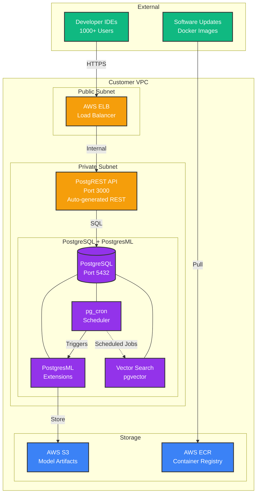
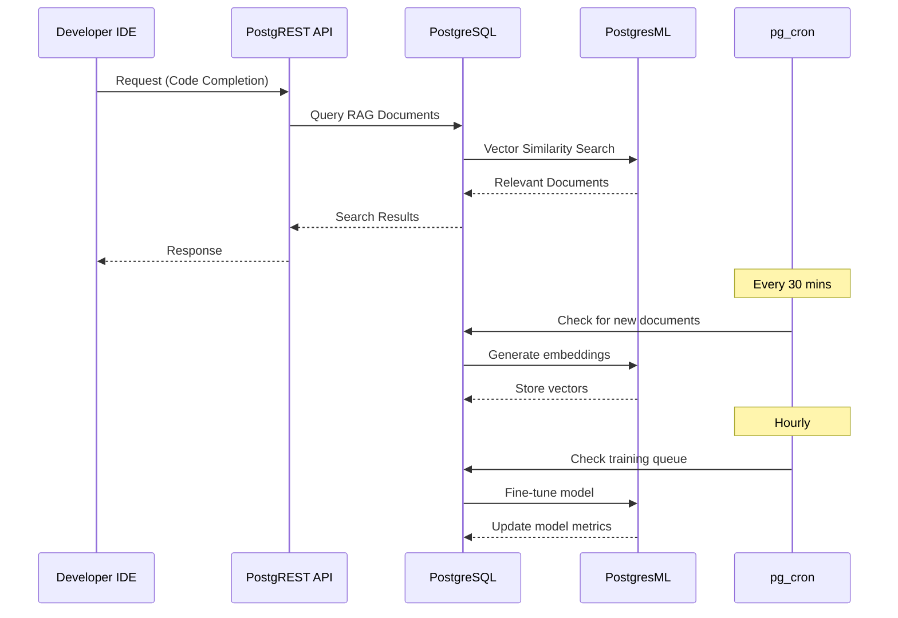
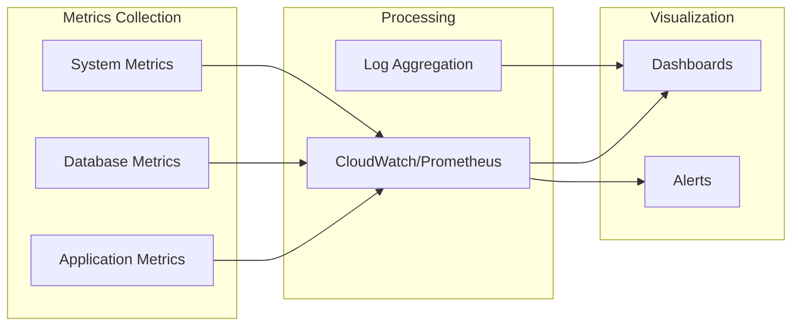
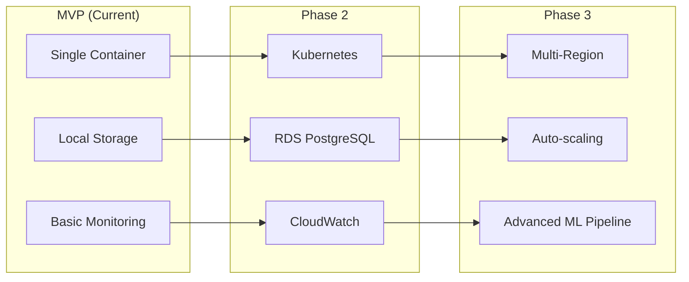

# Poolside Platform MVP - Technical Implementation

## Architecture Diagram



## Data Flow Diagram



## Quick Start

1. **Prerequisites**
   - Docker and Docker Compose installed
   - Port 3000 and 5432 available

2. **Start the platform**
   ```bash
   ./start.sh
   ```

3. **Test the API**
   ```bash
   ./test.sh
   ```

4. **Stop the platform**
   ```bash
   ./stop.sh
   ```

## Core Components

### 1. PostgreSQL with PostgresML
- **Purpose**: Single source of truth for data and ML operations
- **Extensions**:
  - `pgml`: Machine learning capabilities
  - `vector`: Vector similarity search for RAG
  - `pg_cron`: Built-in job scheduling
- **Benefits**: 
  - No external orchestration needed
  - Reduced latency (ML in database)
  - Simplified architecture

### 2. PostgREST
- **Purpose**: Zero-code REST API generation
- **Features**:
  - Automatic endpoint generation from schema
  - Role-based access control
  - OpenAPI documentation
- **Benefits**:
  - No API code to maintain
  - Consistent API patterns
  - Built-in authentication

### 3. pg_cron (Built-in Scheduler)
- **Purpose**: Background job orchestration
- **Scheduled Jobs**:
  - Hourly: Process training queue
  - Every 30 mins: Generate embeddings
  - Daily: Clean up old metrics
  - Weekly: Auto fine-tuning
- **Benefits**:
  - No external scheduler needed
  - Database-native scheduling
  - Transactional guarantees

## Customer Onboarding Considerations

### A. Initial Configuration Concerns

Looking at the architecture, key information to obtain from customers:

1. **Network & Security**
   - VPC CIDR ranges and subnet configurations
   - Security group rules and NACLs
   - SSL certificate management
   - IAM roles and permissions

2. **Scale Requirements**
   - Number of developers (mentioned: 1000+)
   - Peak concurrent requests
   - Data volume for training
   - Expected growth rate

3. **Compliance & Governance**
   - Data residency requirements
   - Audit logging needs
   - Backup and retention policies
   - Encryption requirements (at rest/in transit)

4. **Integration Points**
   - Existing authentication systems (LDAP/SSO)
   - CI/CD pipeline integration
   - Monitoring and alerting systems
   - Source code repositories

### B. Healthy Onboarding Suggestions

#### Phase 1: Pilot (Week 1-2)
- Deploy to isolated development VPC
- Onboard 10-20 power users
- Collect performance baselines
- Validate integration points

#### Phase 2: Limited Rollout (Week 3-4)
- Expand to 100 developers
- Implement monitoring and alerting
- Fine-tune model with customer data
- Document customer-specific configurations

#### Phase 3: Full Deployment (Week 5-6)
- Gradual rollout to all 1000+ developers
- Implement auto-scaling policies
- Enable full observability stack
- Establish support procedures

### C. Observability Strategy



**Key Observability Points**:
1. **Application Level**
   - API response times (p50, p95, p99)
   - Request volume and error rates
   - Model inference latency
   - Cache hit rates

2. **Database Level**
   - Query performance
   - Connection pool utilization
   - Training job queue depth
   - Vector search performance

3. **System Level**
   - CPU/Memory utilization
   - Disk I/O and space
   - Network throughput
   - Container health

## API Endpoints

| Endpoint | Method | Description |
|----------|--------|-------------|
| `/hello` | GET | Test endpoint returning "hello world" |
| `/messages` | GET/POST | Message management |
| `/rag_documents` | GET/POST | RAG document store |
| `/conversations` | GET/POST | Conversation history for fine-tuning |
| `/training_jobs` | GET | Training job status |
| `/model_metrics` | GET | Model performance metrics |
| `/rpc/search_documents` | POST | Vector similarity search |
| `/rpc/schedule_training` | POST | Queue training jobs |

## Background Jobs (pg_cron)

```sql
-- Configured scheduled jobs:
- 'process-training-jobs': Hourly - Process pending training queue
- 'generate-embeddings': Every 30 mins - Create embeddings for new docs
- 'cleanup-metrics': Daily at 2 AM - Remove old metrics
- 'weekly-fine-tune': Sunday 3 AM - Auto fine-tune if sufficient data
```

## Evolution to New Requirements

### Current MVP → Production Evolution



### Handling New Requirements

**Q: How to handle background job scheduling for model fine-tuning?**

**A: Already solved with pg_cron!**
- No external scheduler needed
- Jobs defined in SQL (maintainable)
- Transactional consistency
- Can be monitored via SQL queries

**Future enhancements could include**:
- Web UI for job management
- Webhook notifications
- Priority queues
- Distributed job processing

## Security Considerations

1. **Data Security**
   - All data remains in customer VPC
   - Encryption at rest (PostgreSQL TDE)
   - Encryption in transit (TLS 1.3)

2. **Access Control**
   - Role-based access via PostgREST
   - API key management
   - Audit logging

3. **Network Security**
   - Private subnets for compute
   - Security groups as firewalls
   - No direct internet access

## Files Included

- `docker-compose.yml` - Service orchestration
- `init.sql` - Database initialization with pg_cron jobs
- `start.sh` - Startup script
- `stop.sh` - Shutdown script
- `test.sh` - API testing script
- `README.md` - This documentation

## Testing the Implementation

Run the test script to verify all components:

```bash
# Start the system
./start.sh

# Wait for services to be ready (about 10 seconds)
sleep 10

# Run tests
./test.sh
```

Expected output:
- Hello world endpoint working
- RAG document storage functional
- Training job scheduling operational
- Vector search returning results