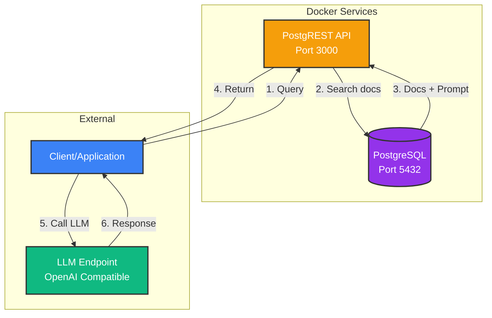
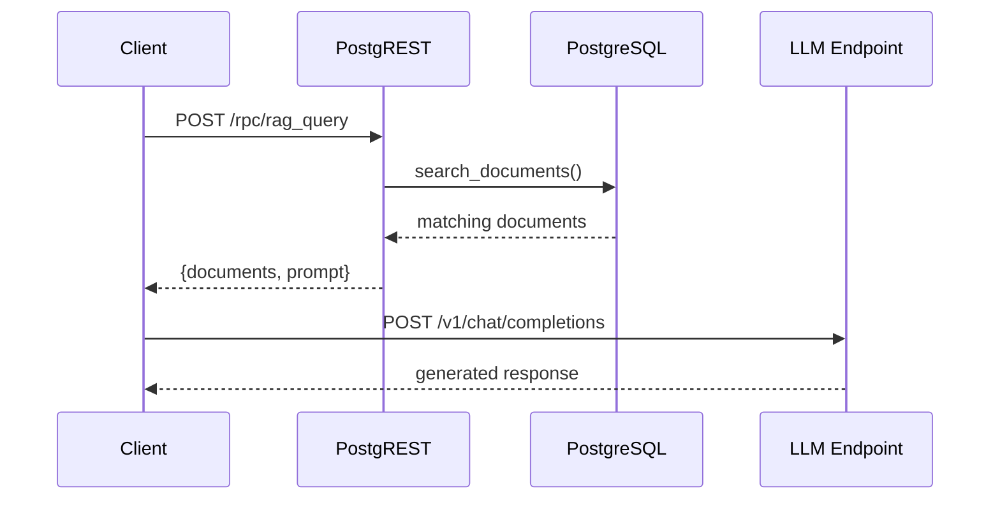

# Simple RAG System

A minimal RAG (Retrieval-Augmented Generation) demonstration using PostgreSQL, PostgREST, and any OpenAI-compatible LLM endpoint (Ollama, vLLM, OpenAI, etc.).

## Architecture



## Data Flow



## Quick Start

### Prerequisites
- Docker and Docker Compose
- Ports 3000 and 5432 available
- Access to an OpenAI-compatible LLM endpoint (Ollama, vLLM, OpenAI, etc.)

### Setup

1. **Configure environment**
   ```bash
   cp .env.example .env
   # Edit .env with your LLM endpoint details
   ```

2. **Start services**
   ```bash
   docker-compose up -d
   ```

3. **Run integration tests**
   ```bash
   ./test.sh
   ```

   The test script demonstrates all API operations and validates the complete RAG workflow. See [test.sh](test.sh) for detailed usage examples.

4. **Stop services**
   ```bash
   docker-compose down
   ```

## Components

- **PostgreSQL** - Document storage with keyword-based search (no vector extensions)
- **PostgREST** - Auto-generated REST API from database schema
- **External LLM** - Any OpenAI-compatible endpoint (Ollama, vLLM, OpenAI, Azure)

## API Reference

### PostgREST (Port 3000)

| Endpoint | Method | Description |
|----------|--------|-------------|
| `/hello` | GET | Health check |
| `/rag_documents` | GET | List documents |
| `/rag_documents` | POST | Add document |
| `/conversations` | GET/POST | Conversation history |
| `/rpc/search_documents` | POST | Search by keywords |
| `/rpc/rag_query` | POST | Get documents + LLM prompt |

**See [test.sh](test.sh) for complete API usage examples with curl commands.**

## How It Works

1. **Store** documents in PostgreSQL
2. **Search** using keyword matching (title + content)
3. **Retrieve** top-matching documents with relevance scores
4. **Build** prompt with document context
5. **Generate** response using external LLM


## Configuration

Copy [.env.example](.env.example) to `.env` and configure your LLM endpoint:

```bash
LLM_ENDPOINT=http://localhost:11434  # Ollama, vLLM, OpenAI, etc.
LLM_MODEL=qwen3:0.6b
LLM_API_KEY=                          # Optional, if required by endpoint
```

## Project Structure

```
.
├── docker-compose.yml      # PostgreSQL + PostgREST services
├── docker-compose.vllm.yml # Optional: Local vLLM deployment
├── init.sql                # Database schema + RAG functions
├── test.sh                 # Integration tests + API usage examples
├── .env.example            # Configuration template
└── README.md
```

## Technical Highlights

- Keyword-based search with relevance scoring
- Auto-generated REST API from database schema
- PostgreSQL functions exposed as RPC endpoints
- OpenAI-compatible LLM integration
- Docker Compose orchestration
- No ML frameworks or vector databases required